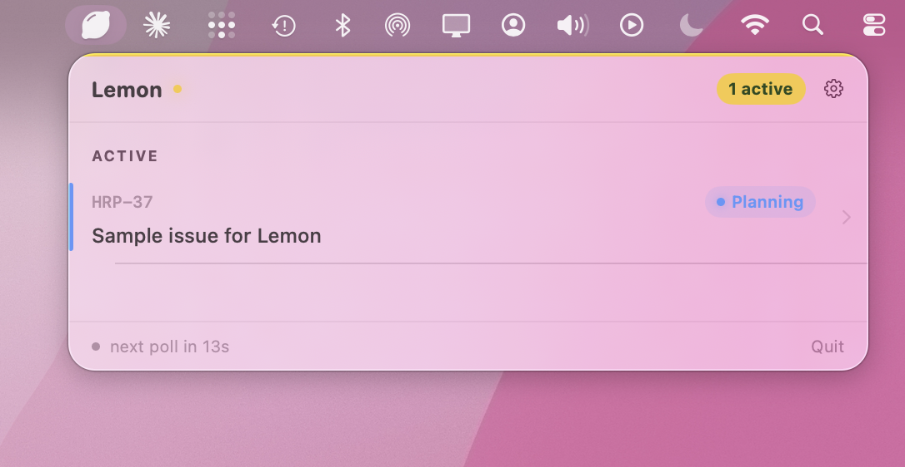
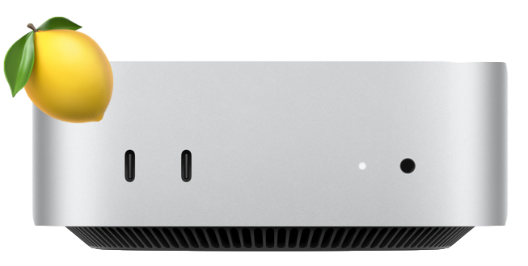
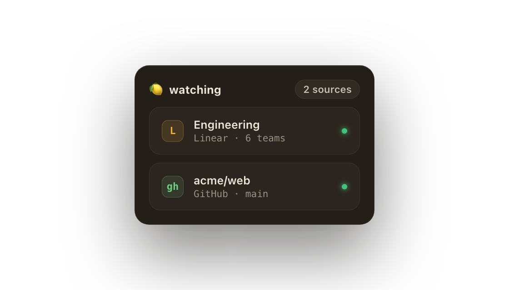
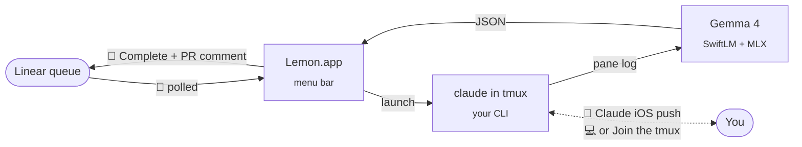
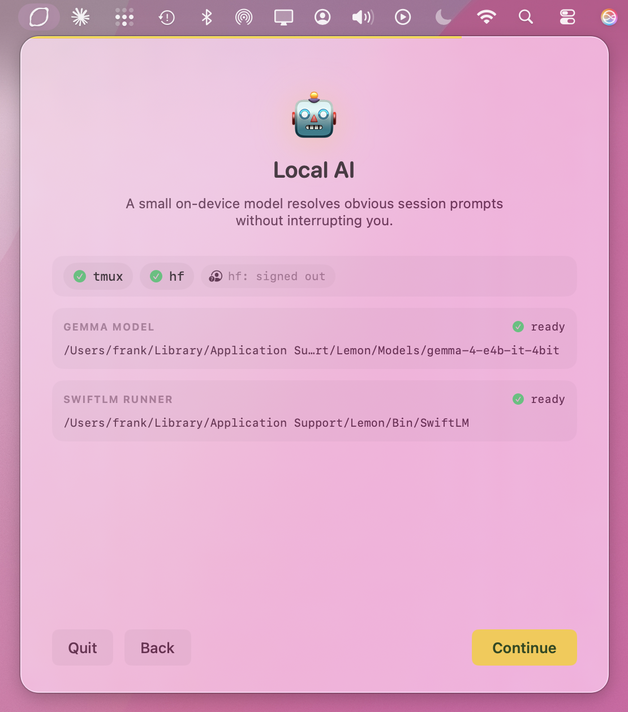

<div align="center">

# 🍋 Lemon

**A personal workflow orchestration menu-bar app for Claude Code + Linear, leveraging Gemma 4 on device.**

<sub><i>Made for the Mac mini sitting on your desk.</i></sub>

<br/>

[](LICENSE)
[]()
[]()
[](https://github.com/SharpAI/SwiftLM)

### → [**lemon.living**](https://lemon.living) ←

[**Install**](#install) · [**How it works**](#how-it-works) · [**The 🍋 workflow**](#the--workflow) · [**Stack**](#stack--gratitude) · [**Releases**](https://github.com/frkline/lemon/releases)

</div>

<br/>

Every coding-agent product I tried wanted to be **the agent** — wrap Claude in their UI, route the API through their servers, sell me an "AI developer."

I already have Claude Code, and I already do the interesting parts: answering Claude's clarifying questions, shaping the plan, reviewing the diff. What I *didn't* want to keep doing by hand was the workflow bureaucracy around it — scanning Linear for what's next, spinning up worktrees, dropping in the right context, transitioning labels, posting the PR comment back.

<div align="center">
<kbd>

</kbd>
</div>

<br/>

Lemon is that menu-bar glue. It runs `claude` (your login, your machine), watches the pane with a tiny on-device Gemma 4 classifier so you don't have to click through every "Trust this MCP server?" prompt yourself, and routes the result back to Linear.

> [!IMPORTANT]
> **Lemon isn't an AI agent product.** The intelligence is Claude Code; the judgment is yours. Lemon handles the workflow bureaucracy around your session so you stay focused on the parts that need a person.

## What Lemon is

A **menu-bar orchestrator** that decides when to start Claude Code. **Glue** between your Linear queue and your Claude Code CLI. A **local Gemma 4 classifier** that auto-accepts obvious confirmations and gently nudges past routine prompts so the session keeps moving. Built for **one developer** running it on their own silicon (❤️ Mac mini).

<div align="center">

</div>

<br/>

## What Lemon isn't

Not an AI agent product — the agent is Claude Code. Not a Claude reseller — Lemon never proxies your API traffic. Not multi-tenant SaaS. Not a substitute for Anthropic, Linear, or anything else in your stack. Not an assignee-style agent meant to stand in for a developer on your team.

## Install

```sh
brew install hf tmux gh claude-code             # Runtime prereqs
```

**Direct download** — signed `.app` from [GitHub Releases](https://github.com/frkline/lemon/releases). Drag to `/Applications`.

**From source** *(macOS 26 · Apple Silicon · Xcode 26)*:

```sh
git clone https://github.com/frkline/lemon
cd lemon && open app/Lemon.xcodeproj
```

Build target **Lemon** in Xcode. First launch runs the onboarding wizard, which gates Continue on a downloaded Gemma 4 (E2B or E4B) and a SwiftLM binary.

<details>
<summary><b>Hardware requirements</b></summary>

| | Requirement |
|---|---|
| **OS** | macOS 26 · Apple Silicon |
| **Gemma 4 E2B** | ~4 GB on disk · runs on 16 GB Macs |
| **Gemma 4 E4B** *(recommended)* | ~6 GB on disk · 24 GB+ RAM |
| **Other** | `tmux`, `hf`, `gh`, authenticated `claude` |

</details>

## Workflow

<div align="center">

<br/>
<sub><i>For Linear, who already knows what work needs doing.</i></sub>
</div>

<br/>

Lemon's entire surface in your Linear workspace is **four labels** and **one comment**.

| Label | Set by | Meaning |
|---|---|---|
| `🍋` | You | Trigger — Lemon picks this up |
| `🍋 In Progress` | Lemon | Worktree active, Claude running |
| `🍋 Waiting` | Claude / Gemma | Paused, needs your input |
| `🍋 Complete` | Claude | PR open, Lemon report posted |

Labels are auto-provisioned in every team you have access to on first launch. Custom 🍋 labels your Linear admin already created are adopted (fetch-or-create).

> [!TIP]
> **When it calls for you, it calls for you — wherever you are.**
>
> Claude Code launches with `--remote-control`, so when Gemma can't resolve a prompt and 🍋 Waiting fires, a push notification lands in the **Claude iOS app** on your phone. You answer the question natively — from the couch, from a walk, from a park bench while your kid is on the swings — and the session keeps going.
>
> Lemon and Gemma absorbed the routine bits so the only thing that reaches you is the one decision that actually needs you.

### How it works



1. **You label** a Linear issue with 🍋.
2. **Orchestrator** picks it up next poll (15 s active, 45 s idle), spins up a git worktree at `/tmp/lemon-{id}`, writes `LEMON_CONTEXT.md` with the issue body + your team's `LEMON.md` + completion checklist.
3. A **terminal window** opens running `claude --enable-auto-mode --remote-control` (iTerm2 preferred, Terminal.app fallback).
4. **Gemma 4** runs locally via SwiftLM + MLX. After 2 minutes of pane silence, it sees the log tail and decides: auto-accept a confirmation (`y / n / Enter / Escape / 1-9`, through a hard allowlist), or raise 🍋 Waiting if it's ambiguous.
5. When Claude sets **🍋 Complete**, Lemon posts the PR link + summary to Linear, then cleans up.

Reply to the Lemon comment on a completed issue to re-trigger a revision pass — Lemon reuses the branch.

## Local AI, by design

<div align="center">
<kbd>

</kbd>
</div>

<br/>

The silence detector, the auto-accept for obvious confirmations, the nudge when Claude is paused on a prompt that doesn't really need a person — all of it runs **on your Mac's GPU** via [MLX](https://github.com/ml-explore/mlx). No round-trip to a cloud classifier. No second API key. No second monthly bill. The whole pattern is only possible because Apple Silicon is genuinely good at this kind of inference, and Apple's MLX team has made it accessible to the rest of us.

What the wizard installs:

- **Gemma 4** quants from [`mlx-community`](https://huggingface.co/mlx-community) — [`gemma-4-e4b-it-4bit`](https://huggingface.co/mlx-community/gemma-4-e4b-it-4bit) (~6 GB, recommended on 24 GB+ Macs) or [`gemma-4-e2b-it-4bit`](https://huggingface.co/mlx-community/gemma-4-e2b-it-4bit) (~4 GB, comfortable on 16 GB)
- **[SwiftLM](https://github.com/SharpAI/SwiftLM)** — an OpenAI-compatible MLX inference server in pure Swift. Signed release binary, pinned to build `b648`.

Both pulled inside the wizard. Nothing is built from source.

> [!NOTE]
> A **Self-test** button in Settings boots the runner, fires one `classify()` call, and reports the actual response. On failure, the error tooltip carries the `log stream` predicate ready to paste into Console.app.

## Stack & gratitude

None of this is from scratch.

| | Project | What |
|---|---|---|
| **Agent** | [Claude Code](https://claude.com/code) (Anthropic) | The intelligence |
| **Runtime** | [SwiftLM](https://github.com/SharpAI/SwiftLM) (SharpAI, `b648`) | OpenAI-compatible MLX inference server in pure Swift |
| **Framework** | [MLX](https://github.com/ml-explore/mlx) (Apple) | Open-source ML for Apple Silicon |
| **Weights** | [`mlx-community`](https://huggingface.co/mlx-community) | Quantized Gemma 4 on HuggingFace |
| **Surface** | [Linear](https://linear.app) | The issue tracker that's the entire Lemon UI for "what's next?" |

**More silicon than you know what to do with?** [oMLX](https://omlx.ai) — same on-device idea, scaled up to Mac Studio's larger MoE models.

<details>
<summary><b>Privacy & egress</b> — what flows where</summary>

<br/>

**Lemon-the-binary** only ever talks to **Linear's GraphQL** for label and comment operations. That's the only network call the orchestrator itself makes.

Everything else flows through tools you launched and authenticated:

| What | Where it goes |
|---|---|
| Issues, labels, comments | Linear API |
| Claude API traffic | Your `claude` CLI → Anthropic (Lemon never sees the bytes) |
| `gh pr create`, `git push` | GitHub, from inside the worktree |
| Gemma 4 inference | **On your Mac's GPU.** Never leaves the machine. |
| Model + runner downloads | **Once**, during onboarding, from HuggingFace + GitHub Releases |
| Telemetry | None. Zero. No analytics SDK. |

Linear API key lives in macOS **Keychain**, not a file. Workspace paths live in UserDefaults. Session logs land in `/tmp/lemon-log-{id}.txt` and are wiped on cleanup.

</details>

<details>
<summary><b>Development</b> — building, testing, smoke-iterating</summary>

<br/>

```sh
make ui                # incremental build + smoke screenshots (~8 s)
make watch             # auto-rebuild + smoke on every .swift save
make test              # XCTest suite
make integration-test  # shell tests: tmux lifecycle + mock Gemma + claude -p
```

UI iteration happens via the smoke test (`scripts/smoke-test.sh`), which drives every screen in-process and dumps PNGs to `/tmp/lemon-smoke/latest/`.

See [`CLAUDE.md`](CLAUDE.md) for the full architecture, smoke loop, and contributor guide.

</details>

## License

Apache 2.0. See [`LICENSE`](LICENSE).

<br/>

<div align="center">
<sub><i>Built by <a href="https://github.com/frkline">Frank Kline</a> as personal workflow tooling. Pull requests welcome.</i></sub>
</div>
