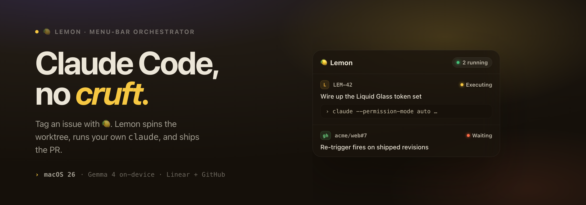
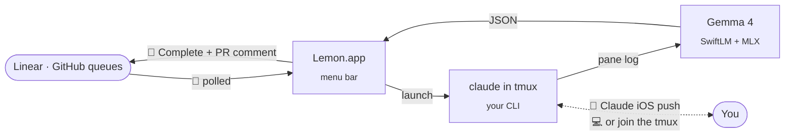

<div align="center">

<picture>
  <source media="(prefers-color-scheme: dark)" srcset="docs/img/readme-hero-dark.png">
  <source media="(prefers-color-scheme: light)" srcset="docs/img/readme-hero-light.png">
  
</picture>

<sub><i>Made for the Mac mini sitting on your desk.</i></sub>

<br/>
<br/>

[](LICENSE)
[]()
[]()
[](https://github.com/SharpAI/SwiftLM)

### → [**lemon.living**](https://lemon.living) ←

[Install](#install) · [Workflow](#workflow) · [Recursive mode](#recursive-mode-let-claude-monitor-lemon) · [Stack](#stack--gratitude) · [Releases](https://github.com/frkline/lemon/releases)

</div>

<br/>

Every coding-agent product I tried wanted to be *the agent* — wrap Claude in their UI, route the API through their servers, sell me an "AI developer."

I already have Claude Code, and I already do the interesting parts: answering Claude's clarifying questions, shaping the plan, reviewing the diff. What I didn't want to keep doing by hand was the bureaucracy around it — scanning Linear for what's next, spinning up worktrees, dropping in the right context, transitioning labels, posting the PR comment back.

<div align="center">
<kbd>

</kbd>
</div>

<br/>

Lemon is a menu-bar orchestrator that decides when to start Claude Code. It is glue between your issue tracker and your own `claude` CLI, with a local Gemma 4 classifier that auto-accepts the obvious confirmations and nudges past routine prompts so a session keeps moving.

You stay in the loop through Claude's remote control — or by joining the running session — to answer the things that actually need a person. Built for one developer, running on their own silicon, against their own inbox.

> [!IMPORTANT]
> Lemon isn't an AI agent product. The intelligence is Claude Code; the judgment is yours. Lemon handles the workflow around your session so you stay focused on the parts that need a person. It is not an assignee-style agent meant to stand in for a developer on your team.

<div align="center">

</div>

<br/>

## Install

Runtime prerequisites:

```sh
brew install hf tmux gh claude-code
```

Then grab the signed `.app` from [GitHub Releases](https://github.com/frkline/lemon/releases) and drag it to `/Applications`. First launch runs the onboarding wizard, which gates Continue on a downloaded Gemma 4 model (E2B or E4B) and the SwiftLM binary.

From source — macOS 26, Apple Silicon, Xcode 26:

```sh
git clone https://github.com/frkline/lemon
cd lemon && open app/Lemon.xcodeproj
```

Build the **Lemon** target in Xcode.

<details>
<summary><b>Hardware requirements</b></summary>

| | Requirement |
|---|---|
| OS | macOS 26 · Apple Silicon |
| Gemma 4 E2B | ~4 GB on disk · runs on 16 GB Macs |
| Gemma 4 E4B *(recommended)* | ~6 GB on disk · 24 GB+ RAM |
| Tooling | `tmux`, `hf`, `gh`, an authenticated `claude` |

</details>

## Workflow

<div align="center">

<br/>
<sub><i>For Linear, who already knows what work needs doing.</i></sub>
</div>

<br/>

Lemon's entire surface — in your Linear workspace or your GitHub repos — is four labels and one comment.

| Label | Set by | Meaning |
|---|---|---|
| `🍋` | You | Trigger — Lemon picks this up on the next poll |
| `🍋 In Progress` | Lemon | Worktree active, Claude running |
| `🍋 Waiting` | Claude / Gemma | Paused, needs your input |
| `🍋 Complete` | Claude | PR open, Lemon report posted |

Labels are provisioned per source pair on first poll — every Linear team you can access, every configured GitHub `owner/repo`. Custom 🍋 labels you or your admin already created are adopted in place (fetch-or-create).

### Sources

Configure up to ten `(source, workspace)` pairs and mix them freely:

- **Linear** — a personal API key from `linear.app/settings → API`. Each pair maps a team prefix like `HRP` to a local repo or folder.
- **GitHub Issues** — a classic or fine-grained PAT with `repo` scope from `github.com/settings/tokens`. Each pair maps `owner/repo` to a local repo or folder.

Both are polled on the same cadence — 15 s when a session is active, 45 s when idle. Webhook triggers are tracked in [#4](https://github.com/frkline/lemon/issues/4); when that lands the trigger source flips but everything downstream stays the same.

> [!TIP]
> When it calls for you, it calls for you — wherever you are.
>
> Claude Code launches with `--remote-control`, so when Gemma can't resolve a prompt and `🍋 Waiting` fires, a push notification lands in the Claude iOS app on your phone. You answer the question natively — from the couch, from a walk, from a park bench while your kid is on the swings — and the session keeps going. The routine bits never reach you; the one decision that needs you does.

### How it works



1. You label an issue — Linear or GitHub — with 🍋.
2. The orchestrator picks it up on the next poll, adds a git worktree at `/tmp/lemon-{slug}`, and writes `LEMON_CONTEXT.md` with the issue body, your team's `LEMON.md`, and a completion checklist.
3. A terminal window opens running `claude --permission-mode auto --remote-control` (iTerm2 if present, Terminal.app otherwise).
4. Gemma 4 runs locally through SwiftLM + MLX. After two minutes of pane silence it reads the log tail and decides: auto-accept a confirmation (`y` / `n` / `Enter` / `Escape` / `1`–`9`, through a hard allowlist), or raise `🍋 Waiting` if it's ambiguous.
5. When Claude sets `🍋 Complete`, Lemon posts the PR link and a summary back to the originating issue, then cleans up the worktree.

Reply to the Lemon comment on a completed issue to re-trigger a revision pass — Lemon reuses the branch. Same behavior on either source.

## Local AI, by design

<div align="center">
<kbd>

</kbd>
</div>

<br/>

The silence detector, the auto-accept for obvious confirmations, the nudge when Claude is paused on a prompt that doesn't really need a person — all of it runs on your Mac's GPU through [MLX](https://github.com/ml-explore/mlx). No round-trip to a cloud classifier, no second API key, no second monthly bill. The pattern only works because Apple Silicon is genuinely good at this kind of inference and Apple's MLX team made it reachable.

What the wizard installs:

- **Gemma 4** quants from [`mlx-community`](https://huggingface.co/mlx-community) — [`gemma-4-e4b-it-4bit`](https://huggingface.co/mlx-community/gemma-4-e4b-it-4bit) (~6 GB, recommended on 24 GB+ Macs) or [`gemma-4-e2b-it-4bit`](https://huggingface.co/mlx-community/gemma-4-e2b-it-4bit) (~4 GB, comfortable on 16 GB).
- **[SwiftLM](https://github.com/SharpAI/SwiftLM)** — an OpenAI-compatible MLX inference server in pure Swift. Signed release binary, pinned to build `b648`.

Both are pulled inside the wizard. Nothing is built from source.

> [!NOTE]
> A Self-test button in Settings boots the runner, fires one `classify()` call, and reports the actual response. On failure the error tooltip carries the `log stream` predicate, ready to paste into Console.app.

## Recursive mode: let Claude monitor Lemon

Lemon can expose its session state and control surface to Claude Code over an MCP server. Flip the toggle in **Settings → MCP Server**, copy the snippet into `~/.claude.json`, and a separate `claude` session can ask things like *what is `HRP-37` doing, and why has it been silent for 40 minutes?* — pulling pane logs and Gemma verdicts straight from the live Lemon process.

```json
{
  "mcpServers": {
    "lemon": {
      "type": "http",
      "url": "http://127.0.0.1:8765/mcp"
    }
  }
}
```

Or launch with the server already on:

```sh
LEMON_ENABLE_MCP=1 open /Applications/Lemon.app
```

The tools the server exposes:

| Read | What |
|---|---|
| `list_sessions` | Active and recent sessions with status, identifiers, timing |
| `get_session` | One session in detail — pane log tail, last Gemma summary, labels, PR URL |
| `get_pane_log` | Raw tmux pane output for a session |
| `get_swiftlm_log` | SwiftLM stderr/stdout tail and current AI state |

| Control | What |
|---|---|
| `force_classify` | Run Gemma on the current pane log now, skipping the two-minute silence wait |
| `send_keys` | Push keystrokes to a session's tmux pane (bypasses the safety allowlist) |
| `stop_session` | Cancel an active session |

> [!NOTE]
> The bind is `127.0.0.1` only, with no auth — the same threat model as Lemon's running process: anyone on this Mac can reach it. The toggle is off by default.

## Stack & gratitude

None of this is from scratch.

| | Project | What |
|---|---|---|
| Agent | [Claude Code](https://claude.com/code) (Anthropic) | The intelligence |
| Runtime | [SwiftLM](https://github.com/SharpAI/SwiftLM) (SharpAI, `b648`) | OpenAI-compatible MLX inference server in pure Swift |
| Framework | [MLX](https://github.com/ml-explore/mlx) (Apple) | Open-source ML for Apple Silicon |
| Weights | [`mlx-community`](https://huggingface.co/mlx-community) | Quantized Gemma 4 on HuggingFace |
| Surface | [Linear](https://linear.app) | The issue tracker that is the entire "what's next?" UI |

More silicon than you know what to do with? [oMLX](https://omlx.ai) — the same on-device idea, scaled up to Mac Studio's larger MoE models.

<details>
<summary><b>Privacy & egress</b> — what flows where</summary>

<br/>

The Lemon binary talks to your configured issue tracker — Linear's GraphQL or GitHub's REST API — for label and comment operations. Those are the only network calls the orchestrator itself makes. Everything else flows through tools you launched and authenticated:

| What | Where it goes |
|---|---|
| Issues, labels, comments | Linear API or GitHub API |
| Claude API traffic | Your `claude` CLI → Anthropic (Lemon never sees the bytes) |
| `gh pr create`, `git push` | GitHub, from inside the worktree |
| Gemma 4 inference | Your Mac's GPU. Never leaves the machine. |
| Model + runner downloads | Once, during onboarding, from HuggingFace + GitHub Releases |
| Telemetry | None. No analytics SDK. |

Credentials live in the macOS Keychain, not a file. Workspace paths live in UserDefaults. Session logs land in `/tmp/lemon-log-{id}.txt` and are wiped on cleanup.

</details>

<details>
<summary><b>Development</b> — building, testing, smoke-iterating</summary>

<br/>

```sh
make ui                # incremental build + smoke screenshots (~8 s)
make watch             # auto-rebuild + smoke on every .swift save
make test              # XCTest suite
make integration-test  # shell tests: tmux lifecycle + mock Gemma + claude -p
```

UI iteration runs through the smoke test (`scripts/smoke-test.sh`), which drives every screen in-process and dumps PNGs to `/tmp/lemon-smoke/latest/`. The design language — the ethos, typography, and component specs — lives in [`design/`](design/) as an HTML mirror and ships as the marketing site at [lemon.living](https://lemon.living), served from [`docs/`](docs/).

See [`CLAUDE.md`](CLAUDE.md) for the full architecture, smoke loop, and contributor guide.

</details>

## License

Apache 2.0. See [`LICENSE`](LICENSE).

<br/>

<div align="center">
<sub><i>Built by <a href="https://github.com/frkline">Frank Kline</a> as personal workflow tooling. Pull requests welcome.</i></sub>
</div>
