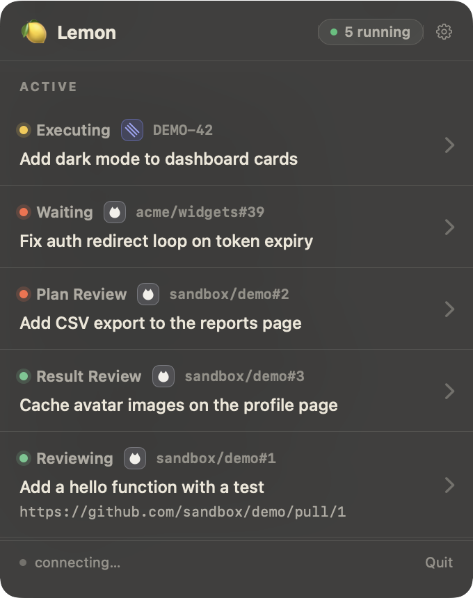
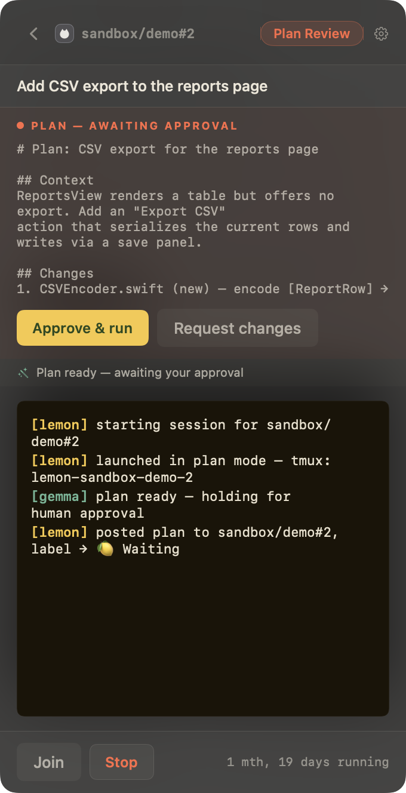
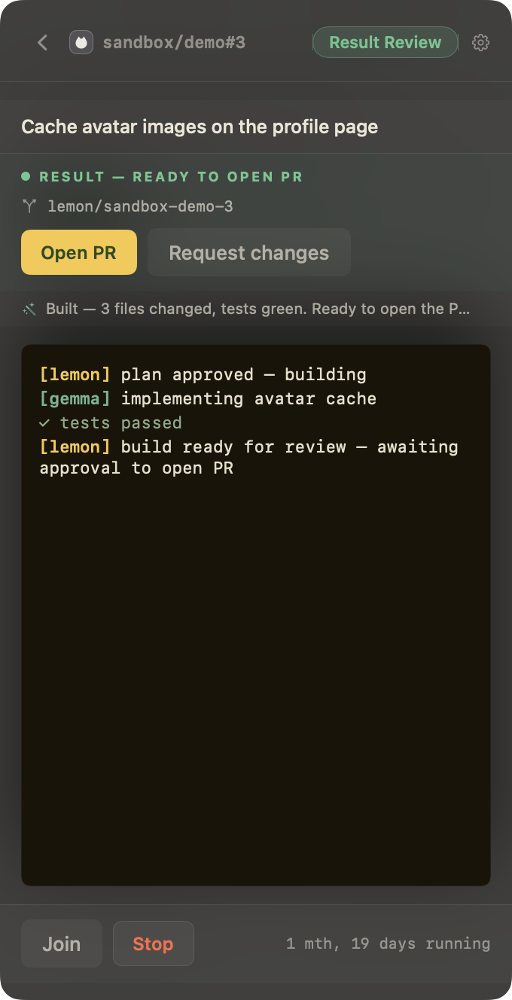
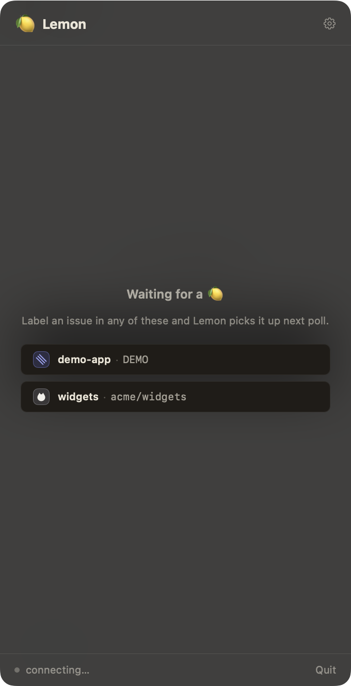
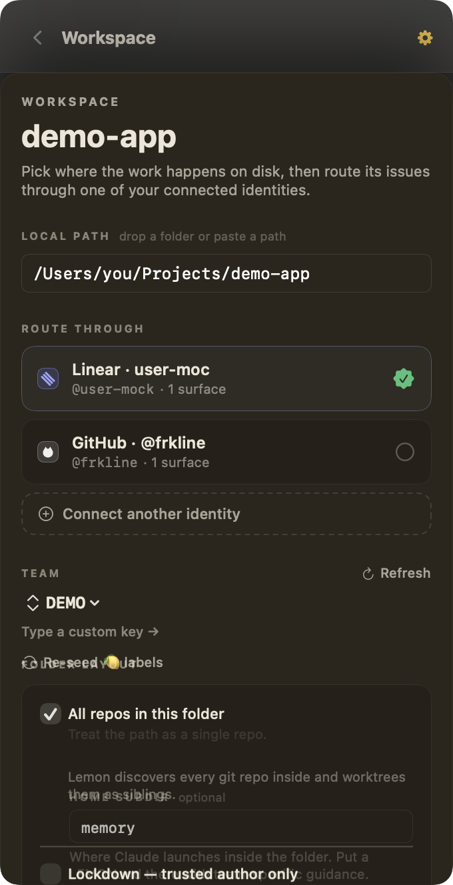
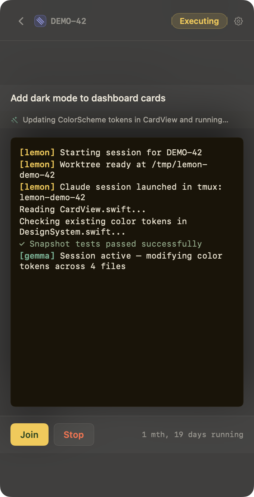

<div align="center">

<picture>
  <source media="(prefers-color-scheme: dark)" srcset="https://raw.githubusercontent.com/frkline/lemon/main/docs/img/readme-hero-dark.png">
  <source media="(prefers-color-scheme: light)" srcset="https://raw.githubusercontent.com/frkline/lemon/main/docs/img/readme-hero-light.png">
  
</picture>

<sub><i>Made for the Mac mini sitting on your desk.</i></sub>

<br/>
<br/>

[](LICENSE)
[]()
[]()
[](https://github.com/SharpAI/SwiftLM)

### → [**lemon.living**](https://lemon.living) ←

[Install](#install) · [Workflow](#workflow) · [Trust &amp; lockdown](#trust--lockdown) · [Local AI](#local-ai) · [Recursive mode](#recursive-mode) · [Dogfooding](DOGFOOD.md) · [Stack](#stack--gratitude) · [Releases](https://github.com/frkline/lemon/releases)

</div>

<br/>

Lemon is a menu-bar app that orchestrates Claude Code from your issue tracker. Tag an issue with 🍋 and Lemon cuts a git worktree, drops in the right context, and launches *your own* `claude` CLI in a terminal. A small local model handles the routine confirmations so a session keeps moving; you step in only for the decisions that need a person.

It is deliberately thin. The intelligence is Claude Code, running under your login; the judgment is yours. Lemon is the glue between your tracker and your session — it watches the queue, manages worktrees and labels, gates the work behind your approval, and posts the report when the PR is open.

<div align="center">

</div>

> [!IMPORTANT]
> Lemon is not an AI-agent product and not an assignee meant to stand in for a developer. It does not wrap Claude in another UI or route your traffic through anyone's servers. It decides *when* to start Claude Code and handles the workflow around the session — nothing more.

## Install

Runtime prerequisites:

```sh
brew install hf tmux gh claude-code
```

Download the signed `.app` from [GitHub Releases](https://github.com/frkline/lemon/releases) and drag it to `/Applications`. First launch runs the onboarding wizard, which gates Continue on a downloaded Gemma 4 model (E2B or E4B) and the SwiftLM binary.

Build from source — macOS 26, Apple Silicon, Xcode 26:

```sh
git clone https://github.com/frkline/lemon
cd lemon && open app/Lemon.xcodeproj
```

Build the **Lemon** target in Xcode.

<details>
<summary><b>Hardware requirements</b></summary>

| | Requirement |
|---|---|
| OS | macOS 26 · Apple Silicon |
| Gemma 4 E2B | ~4 GB on disk · runs on 16 GB Macs |
| Gemma 4 E4B *(recommended)* | ~6 GB on disk · 24 GB+ RAM |
| Tooling | `tmux`, `hf`, `gh`, an authenticated `claude` |

</details>

## Workflow

A 🍋 issue runs as **one Claude session with two human gates**. Lemon's whole surface — in Linear or in GitHub — is a handful of labels and one comment.

| Label | Set by | Meaning |
|---|---|---|
| `🍋` | You | Trigger — Lemon picks it up on the next poll |
| `🍋 auto` | You | Autopilot — skip the plan gate for trivial work |
| `🍋 In Progress` | Lemon | Worktree active, Claude running |
| `🍋 Waiting` | Claude / Gemma | Paused at a gate or a question that needs you |
| `🍋 Complete` | Claude | PR open, Lemon report posted |

Labels are provisioned per source on first poll and adopted in place if you or your admin already created them (fetch-or-create).

1. **You label an issue** — Linear or GitHub — with 🍋.
2. **Lemon picks it up** on the next poll, adds a git worktree at `/tmp/lemon-{slug}`, and writes `LEMON_CONTEXT.md` with the issue body, your team's `LEMON.md`, and a completion checklist.
3. **Claude launches in plan mode** (`claude --permission-mode plan --remote-control`) in a terminal window — iTerm2 if present, Terminal.app otherwise. It first triages the issue (clear? not a duplicate? unblocked?), then proposes a **plan**. Lemon posts the plan to the issue and parks at the **plan gate**.
4. **You approve the plan** — from Lemon's popover, by replying on the issue, or from your phone — and the *same* session continues into the build in auto mode. Gemma 4 auto-accepts routine confirmations through a hard allowlist and raises `🍋 Waiting` only when something genuinely needs you.
5. **An optional result gate** holds before the PR opens, so you can review first. Then Claude opens the PR, Lemon posts the report back to the issue and cleans up the worktree.

Reply to the Lemon report on a completed issue to re-trigger a revision pass; Lemon reuses the branch. Behavior is identical on either source.

<div align="center">

&nbsp;&nbsp;

<br/>
<sub><i>The two gates: approve the <b>plan</b> before the build, review the <b>result</b> before the PR.</i></sub>
</div>

### Sources

Configure up to ten `(source, workspace)` pairs and mix them in one queue:

- **Linear** — a personal API key from `linear.app/settings → API`. Each pair maps a team prefix like `HRP` to a local repo or folder.
- **GitHub Issues** — a classic or fine-grained PAT with `repo` scope from `github.com/settings/tokens`. Each pair maps `owner/repo` to a local repo or folder.

Both poll on the same cadence — 15 s when a session is active, 45 s when idle. Webhook triggers are tracked in [#4](https://github.com/frkline/lemon/issues/4); when that lands, the trigger source flips but everything downstream stays the same.

Running Lemon on its own issues? [`DOGFOOD.md`](DOGFOOD.md) is the operator workloop — pre-flight, trigger, monitor via MCP + tmux, the two gates, and the known failure modes.

<div align="center">

<br/>
<sub><i>One queue — Linear teams and GitHub repos, watched together.</i></sub>
</div>

> [!TIP]
> Claude launches with `--remote-control`, so when Gemma can't resolve a prompt and `🍋 Waiting` fires, a push notification lands in the Claude iOS app. You answer the question from wherever you are, and the session keeps going. The routine prompts never reach you; the decision that needs you does.


The menu-bar glyph reflects aggregate state at a glance: **idle · working · waiting · done · error**.

## Trust &amp; lockdown

A 🍋 label turns issue text into an auto-mode Claude session, so on a public repo untrusted issue and comment content is an attack surface. Lemon treats it as one.

Each workspace has a **Lockdown** toggle, **on by default for GitHub**: only issues *you* opened trigger, only *your* replies re-trigger, and anyone else's content is kept out of the model's context. With lockdown off, outside content is still wrapped in an untrusted-data delimiter so Claude treats it as data, not instructions.

`--permission-mode auto` is not unrestricted, either. Bash inside the `/tmp/lemon-{slug}` worktree is auto-accepted; reads outside it (`~/.ssh`, `~/.aws`) still prompt. Network egress inside the worktree is auto-accepted today — treat low-trust repos accordingly.

<div align="center">

</div>

## Local AI

<div align="center">

</div>

<br/>

The silence detector, the auto-accept for obvious confirmations, and the nudge past prompts that don't really need a person all run on your Mac's GPU through [MLX](https://github.com/ml-explore/mlx) — no cloud classifier, no second API key, no second bill. Only a real question reaches you, as `🍋 Waiting` plus a phone push.

What the wizard installs:

- **Gemma 4** quants from [`mlx-community`](https://huggingface.co/mlx-community) — [`gemma-4-e4b-it-4bit`](https://huggingface.co/mlx-community/gemma-4-e4b-it-4bit) (~6 GB, recommended on 24 GB+ Macs) or [`gemma-4-e2b-it-4bit`](https://huggingface.co/mlx-community/gemma-4-e2b-it-4bit) (~4 GB, comfortable on 16 GB).
- **[SwiftLM](https://github.com/SharpAI/SwiftLM)** — an OpenAI-compatible MLX inference server in pure Swift. Signed release binary, pinned to build `b648`.

Both are pulled inside the wizard; nothing is built from source.

> [!NOTE]
> A Self-test button in Settings boots the runner, fires one `classify()` call, and reports the actual response. On failure the error tooltip carries the `log stream` predicate, ready to paste into Console.app.

## Recursive mode

Lemon can expose its session state and control surface to Claude Code over an MCP server. Flip the toggle in **Settings → MCP Server**, copy the snippet into `~/.claude.json`, and a separate `claude` session can ask things like *what is `HRP-37` doing, and why has it been silent for 40 minutes?* — pulling pane logs and Gemma verdicts straight from the live Lemon process.

```json
{
  "mcpServers": {
    "lemon": {
      "type": "http",
      "url": "http://127.0.0.1:8765/mcp"
    }
  }
}
```

Or launch with the server already on:

```sh
LEMON_ENABLE_MCP=1 open /Applications/Lemon.app
```

The tools the server exposes:

| Read | What |
|---|---|
| `list_sessions` | Active and recent sessions with status, identifiers, timing |
| `get_session` | One session in detail — pane log tail, last Gemma summary, labels, PR URL |
| `get_pane_log` | Raw tmux pane output for a session |
| `get_swiftlm_log` | SwiftLM stderr/stdout tail and current AI state |

| Control | What |
|---|---|
| `force_classify` | Run Gemma on the current pane log now, skipping the silence wait |
| `send_keys` | Push keystrokes to a session's tmux pane (bypasses the safety allowlist) |
| `stop_session` | Cancel an active session |

> [!NOTE]
> The server binds `127.0.0.1` only, with no auth — the same threat model as Lemon's running process: anyone on this Mac can reach it. The toggle is off by default.

## Stack &amp; gratitude

None of this is from scratch.

| | Project | What |
|---|---|---|
| Agent | [Claude Code](https://claude.com/code) (Anthropic) | The intelligence |
| Runtime | [SwiftLM](https://github.com/SharpAI/SwiftLM) (SharpAI, `b648`) | OpenAI-compatible MLX inference server in pure Swift |
| Framework | [MLX](https://github.com/ml-explore/mlx) (Apple) | Open-source ML for Apple Silicon |
| Weights | [`mlx-community`](https://huggingface.co/mlx-community) | Quantized Gemma 4 on Hugging Face |
| Surface | [Linear](https://linear.app) · [GitHub](https://github.com) | The trackers Lemon watches |

Have more silicon than you know what to do with? [oMLX](https://omlx.ai) takes the same on-device idea and scales it up to Mac Studio's larger MoE models.

<details>
<summary><b>Privacy &amp; egress</b> — what flows where</summary>

<br/>

The Lemon binary talks to your configured issue tracker — Linear's GraphQL or GitHub's REST API — for label and comment operations. Those are the only network calls the orchestrator itself makes. Everything else flows through tools you launched and authenticated:

| What | Where it goes |
|---|---|
| Issues, labels, comments | Linear API or GitHub API |
| Claude API traffic | Your `claude` CLI → Anthropic (Lemon never sees the bytes) |
| `gh pr create`, `git push` | GitHub, from inside the worktree |
| Gemma 4 inference | Your Mac's GPU. Never leaves the machine. |
| Model + runner downloads | Once, during onboarding, from Hugging Face + GitHub Releases |
| Telemetry | None. No analytics SDK. |

Credentials live in the macOS Keychain, not a file. Workspace paths live in UserDefaults. Session logs land in `/tmp/lemon-log-{id}.txt` and are wiped on cleanup.

On first use macOS may show a **"Local Network"** prompt — it's safe to deny. Lemon does no LAN discovery; the prompt is triggered by the on-device Gemma classifier (SwiftLM), which binds `127.0.0.1` only, so it's the Mac talking to itself over loopback. Classification works whether you allow or deny.

</details>

<details>
<summary><b>Development</b> — building, testing, smoke-iterating</summary>

<br/>

```sh
make ui                # incremental build + smoke screenshots (~8 s)
make watch             # auto-rebuild + smoke on every .swift save
make test              # XCTest suite
make integration-test  # shell tests: tmux lifecycle + mock Gemma + claude -p
make sandbox-test      # drive a 🍋 issue end-to-end, no tokens or side effects
```

UI iteration runs through the smoke test (`scripts/smoke-test.sh`), which drives every screen in-process and dumps PNGs to `/tmp/lemon-smoke/latest/`. The workflow sandbox (`LEMON_SANDBOX=1`) runs the full plan → gate → build → gate → PR lifecycle against local fixtures with a scripted `claude` stand-in.

The design language — ethos, typography, and component specs — lives in [`design/`](design/) as an HTML mirror and ships as the marketing site at [lemon.living](https://lemon.living), served from [`docs/`](docs/). See [`CLAUDE.md`](CLAUDE.md) for the full architecture and contributor guide.

</details>

## License

Apache 2.0. See [`LICENSE`](LICENSE).

<br/>

<div align="center">
<sub><i>Built by <a href="https://github.com/frkline">Frank Kline</a> as personal workflow tooling. Pull requests welcome.</i></sub>
</div>
